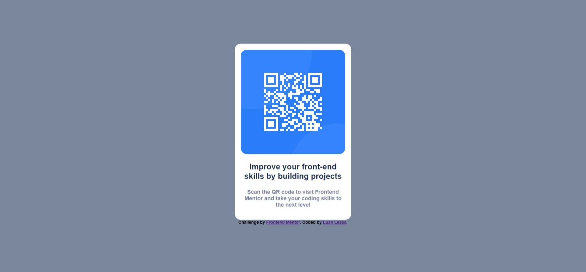

# Frontend Mentor - QR code component solution

This is a solution to the [QR code component challenge on Frontend Mentor](https://www.frontendmentor.io/challenges/qr-code-component-iux_sIO_H). Frontend Mentor challenges help you improve your coding skills by building realistic projects. 

## Table of contents

- [Overview](#overview)
  - [Screenshot](#screenshot)
  - [Links](#links)
- [My process](#my-process)
  - [Built with](#built-with)
  - [What I learned](#what-i-learned)
  - [Continued development](#continued-development)
  - [Useful resources](#useful-resources)
- [Author](#author)

## Overview

### Screenshot



### Link

- Live Site URL: [qr-code-component.github.io](https://luanlessa.github.io/qr-code-component.github.io/)

## My process

### Built with

- Semantic HTML5 markup
- CSS custom properties

### What I learned

This is a simple project but I learned a lot of new things, as using a google font,
new css commands like "border-radius", "font-weight" and "rem" for text-size:
```html
<link rel="stylesheet" href="https://fonts.google.com/specimen/Outfit">
```
```css
.body {
  font-family: "Outfit", sans-serif;
  font-weight: 700;
}
.content{
  border-radius: 1rem;
}
```

### Continued development

Hope to continue learning responsive designs and new css and html techniques.

### Useful resources

- [W3 Schools](https://www.w3schools.com/) - This helped me with basic html and css semantics, it has a lot of resources.
- [Stack Overflow](https://stackoverflow.com/) - This is an amazing website for QA.

## Author

- Website - [Luan Lessa](https://github.com/LuanLessa)
- Frontend Mentor - [@LuanLessa](https://www.frontendmentor.io/profile/LuanLessa)